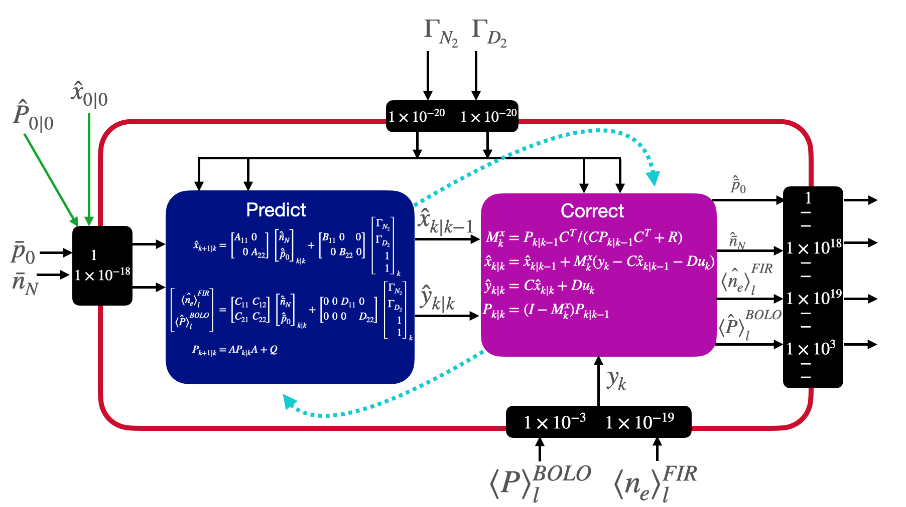

March 12th 2024

# Summary of the Day's Progress
In the past week I have done the following:  

0. Changed the averaged area $\bar{p}_0$ $\bar{n}_N$ (and made a coding pipeline to change this area quickly). Also this changes the steady-state fits.
1. Created linear BOLO and FIR map based on the state
2. Created linear state dynamics based (A and B) on the steady-state values obtained from SOLPS-ITER
3. Created a Linear Kalman Filter based on all of the above and tested it against experimental data

## Details

### 0. Changed the averaged area $\bar{p}_0$ and $\bar{n}_N$ (and made a coding pipeline to change this area quickly)  

I did this because I realized the steady-state (linear, no intercept) fits from input to state (i.e., $`\Gamma_{D_2} \rightarrow \bar{p}_0`$ $\Gamma_{N_2} \rightarrow \bar{n}_N$) were not very good. Additionally the spread of the data for each discrete input indicated a strong need for another explanatory variable which is not desirable as the assumption here is two individual, completely decoupled SISO systems.

**N.B** The new areas over which the state is being averaged does not include the complete divertor region


### 1. Created linear BOLO and FIR map based on the state  

I created a data pipeline to inspect which BOLO chords and FIR should like to be chosen. In this case I averaged all the values from the line integrated power values from all the BOLO and FIR chords intersecting the divertor region. Additionally, since not all BOLO sensors function on each experiment, you can take the intersection of experiments of interest and use only those BOLO chords.


### 2. Created linear state dynamics based (A and B) on the steady-state values obtained from SOLPS-ITER  

The output mapping is chosen by the linear fits of the BOLO and FIR (i.e., $C$ $D$), but the state dynamics (i.e., $A$ $B$) are still unknown. What *is* known about the state dynamics are the steady-state values for $\bar{p}_0$ and $\rightarrow$ $\bar{n}_N$. In other words steady-state can be described as:  

$`\begin{align}
0 &= Ax + Bu \\
x &= -A^{-1}Bu \\
&\rightarrow -A^{-1}B = \begin{bmatrix}
    \frac{\bar{n}^{ss}_N}{\Gamma^{ss}_{N_2}} & 0 \\
    0 & \frac{\bar{p}^{ss}_0}{\Gamma^{ss}_{D_2}}
\end{bmatrix}
\end{align}`$

This however still leaves infinitely many solutions to $A$ and $B$ as there are 4 unknowns (since A and B are assumed diagonal) and only two equations. We can further restrict this problem by turning it into two least squares problems with linear constraints:

$ \begin{align}
\min_{B_{11},A_{11}} &||A_{11}X_1 - B_{11}U_1||^2_2 \\
\min_{B_{22},A_{22}} &||A_{22}X_2 - B_{22}U_2||^2_2 \\
B_{11} &+ A_{11} + \frac{\bar{n}^{ss}_N}{\Gamma^{ss}_{N_2}} = 0  \\
B_{22} &+ A_{22} + \frac{\bar{p}^{ss}_0}{\Gamma^{ss}_{D_2}} = 0 
\end{align}$

Here $X_1$ and $U_1$ are the set of 55 data points from the simulations. We also know that we want the discrete form of the state space to be Hurwitz stable which means the eigenvalues need to be within the unit circle.

This results in rather trivial solutions for A and B as the equality constraints are rather strict.

It would be better to choose the values based on an optimization problem with the same constraints, but the least squares problem is constructed using data from real experiments. In this way, the A and B would have a steady-state solution which abides by SOLPS while conforming to experimental data in the least squares sense. This would be advantageous as the dynamic model used by the Kalman Filter may then not be too far off from experiment.

### 3. Created a Linear Kalman Filter based on all of the above

$\begin{align}
x_{k+1} &= Ax_k + Bu_k + Gw_k \\
y &= Cx_k + Du_k + Hw_k + Iv_k\\
\hat{x}_{k+1|k} &= \begin{bmatrix}
A_{11} &\ 0 \\
0  &\ A_{22}
\end{bmatrix} \begin{bmatrix}
\hat{\bar{n}}_N \\
\hat{\bar{p}}_0
\end{bmatrix}_{k|k} + \begin{bmatrix}
B_{11} &\  0 &\; 0 \\
0 &\ B_{22} &\ 0
\end{bmatrix} \begin{bmatrix}
\Gamma_{N_2} \\
\Gamma_{D_2} \\
1 \\
1
\end{bmatrix}_k \\
\begin{bmatrix} 
\hat{\langle n_e \rangle} ^{FIR}_{l} \\
\hat{\langle P \rangle} ^{BOLO}_{l} 
\end{bmatrix} &= \begin{bmatrix} C_{11} &\ C_{12} \\
C_{21}  &\ C_{22}
\end{bmatrix} \begin{bmatrix}
\hat{\bar{n}}_N \\
\hat{\bar{p}}_0
\end{bmatrix}_{k|k} + \begin{bmatrix}
0 &\ 0 &\ D_{11} &\ 0 \\
0 &\ 0 &\ 0  &\ D_{22}
\end{bmatrix} \begin{bmatrix}
\Gamma_{N_2} \\
\Gamma_{D_2} \\
1 \\
1
\end{bmatrix}_k\\
P_{k+1|k} &= AP_{k|k}A + Q \\
G &= I \\
H &= 0 \\
M^x_k &= P_{k|k-1}C^T/(CP_{k|k-1}C^{T}+R)\\
\hat{x}_{k|k} &= \hat{x}_{k|k-1} + M^x_k(y_k - C\hat{x}_{k|k-1} - Du_k) \\
\hat{y}_{k|k} &= C\hat{x}_{k|k} + Du_k \\
P_{k|k} &= (I - M^x_k)P_{k|k-1}\\
\end{align}$

$u$ and therefore $D$ are augmented to account for the linear offset in the maps (i.e., the maps are linear and of the form $y = ax_1 + bx_2 +c$ where the offset of $c$ needs to be accounted for)

$\begin{align}
D &= \begin{bmatrix}
0 & 0 & 0.3227 & 0 \\
0 & 0 & 0  & 1.8556
\end{bmatrix} \\
u_k &= [\Gamma_{N_2} \hspace{5pt} \Gamma_{D_2} \hspace{5pt} 1 \hspace{5pt} 1]
\end{align}$

There was also of course scaling that needed to be done as the range of values spanned from $1e10$ to $1e20$. Below is a diagram of how the kalman filter operates as well as the scaling factors.

 

### 4. Tested the Kalman filter against data

I needed to first figure out a way to sample the measurement data so as to align all their respective sample times. I created a simple zoh algorithm to do this. The fundamental sampling time is based on the diadnostic with the shortest sampling time which was the FIR:

```
k = FIR_i_start:FIR_i_stop; % start and stop indeces of FIR
y = zeros(length(k),2);
u = zeros(length(k),1);
Ts = min(diff(FIR_time(FIR_i_start:FIR_i_stop)));
j = BOLO_i_start;
m = Gas_i_start;
l = FIR_i_start;
% the sample at which the 
% underlying sampling of all the sensors
% equals the desired start time
sample_start = FIR_start/Ts; 

for i=1:size(k,2)

  % don't update if time has not increased
  y(i,1) = FIR_time(l);
  y(i,2) = BOLO_time(j);
  u(i,1) = Gas_time(m);

  % update if time has not increased
  if (i+sample_start)*Ts >= FIR_time(l)
      y(i,1) = FIR_time(l);
      l = l+1;
  end
  if (i+sample_start)*Ts >= BOLO_time(j)
      y(i,2) = BOLO_time(j);
      j=j+1;
  end
  
  if (i+sample_start)*Ts >= Gas_time(m)
      u(i,1) = Gas_time(m);
      m=m+1;
  end
end
```

Below you can see the sample times lining up with real time. This is a zoomed in image at the end of the sample.


#### Validation

Validating this KF with real data showed there is quite a bit of model mismatch which is apparent in the plotting.


If I set my trust in the model quite high (i.e., a high $Q$) and trust in the measurements low (i.e., low $R$). Then the measurement signal is indeed quickly followed. However, in this case this translate into negative states (e.g., negative densities) which are non-physical.


There are ways to deal with constrained Kalman Filters. An attractive one to me that I have seen in a textbook [Optimal State Estimate by Dan Simon] performs an online quadratic optimization problem with imposed inequality constraints. 

$ \begin{align}
\tilde{x} = \argmin_{\tilde{x}} &(\tilde{x} - \hat{x})^TW(\tilde{x} - \hat{x}) \\
s.t. \quad &\Psi\tilde{x} \le d\\
\end{align}$

Here, $\Psi$ would be filled with negative ones and $d$ would be $0$ to make the inequality constraint that the constrained $\tilde{x}$ is always greater than $0$. However, this just results in a $0$ value always since the constraint would always be active in this case.

There are also variance test you can do on the residual to check for an optimally perforaming kalman filter. That is, the covariance of your residual should have the following qualities if your Kalman Filter is working optimally:

$\begin{align}
E = [e_i^Te_k] = \pm(1.96/N^{1/2})\\
E = [e^Te] = 0 \text{ for } j \neq i \\
E = [e_k^Te_k] = CLC^T + R
\end{align}$

Where $L$ is the steady-state error covriance and $N$ is the number of samples.

## Next Steps


### Linear Kalman Filter (options)
0. Add a parameter $A_{21}$ to account for the effect of $\Gamma_{N_2}$ on the neutral pressure. 
1. Try to choose FIR lines which create a sensitive FIR plot to $\bar{n}_N$ and if that doesn't work then may have to change the averaged regions.
2. Create a least-squares problem between the experimental data and the model where the optimization variables are $A$ and $B$ and they are constrained by the steady-state SOLPS solution and the fact that they must be Hurwitz.
3. Try to implement more complicated dynamics from Jesse's paper and perform point 1 (above) to "marry" the SOLPS output and steady-state to experimental data.

### Other
- Make a third output corresponding to the location of the $y_{CIII}$ front.
- Asked Guangyu for clarity on how to calculate the critical parameters, but in any case will need to recreate plots of critical parameters given Guangyu's new emails:  

"For your question, the total heat flux includes electron/ion kinetic energy flux, potential energy flux, etc. **You can access each component in SOLPS_get, i.e. fhex, fhix, etc**. The only-plasma flux should be eletron+ion kinetic energy flux, total perpendicular flux density is 'qperp'. 
For your 2nd question, flux quantities are not taken at the cell center but cell surface, so two "guard cells" on the two ends of the poloidal grid (96+2)."
- The model mismatch also seems to have to do with a problem with the newly minted averaged-areas for the states. They were chosen to make $\bar{p}_0$ and $\bar{n}_N$ linear with $\Gamma_{D_2}$ and $\Gamma_{N_2}$ respectively, but in doing so made $y_{FIR}$ weakly dependent on $\bar{n}_N$. Need to investigate the effect of this. 
- Find an aswer as to why following the experiental output leads to a negative $\bar{n}_N$.

### Continue with the other steps from [EndMarchCheckpoint](EndMarchCheckpoint.md):

1. Making more SynthDiag mappings $\rightarrow$ $y_{CIII}$ map

2. <s> Making fake state dynamics with the steady-state response from SOLPS-ITER sims </s>

3. <s> Implementing a (linear) Kalman Filter </s> 

## Bigger Picture
### - $f(\bar{p}_0, \bar{n}_N)$ $\rightarrow$
### - Using $f(\bar{p}_0, \bar{n}_N)$ part of the Kalman filter update step becomes $K(y - f(\bar{p}_0, \bar{n}_N))$ where $y$ are the real sensor measurements and $K$ comes from (among other things) the process noise as defined by the RMSE of the fit on $f(\bar{p}_0, \bar{n}_N)$ $\rightarrow$

### - Create Best Guess Transfer Function (BGTF) for the state model with the steady-state being derived from linear fit on input output of sims.

### - Validating/testing both Kalman Filter and $f(\bar{p}_0, \bar{n}_N)$ comes down to using experimental data and BGTF (and eventually the FRF system identification of TCV exhaust) to update the state (i.e., the "State Model" block) in the loop with the Kalman Filter and checking that the of the KF residual has constant variance and zero mean. --> using $f(\bar{p}_0, \bar{n}_Z)$ the kalman filter residual becomes $K(y - f(p_0, n_Z))$ where $y$ are the real sensor measurements 
