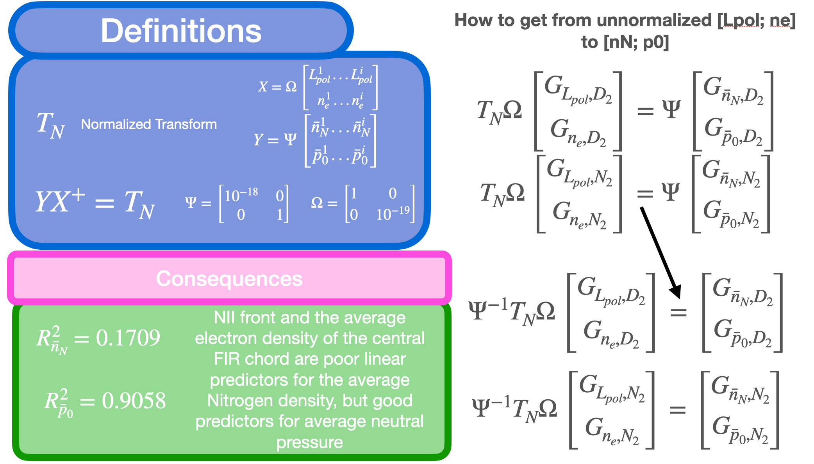
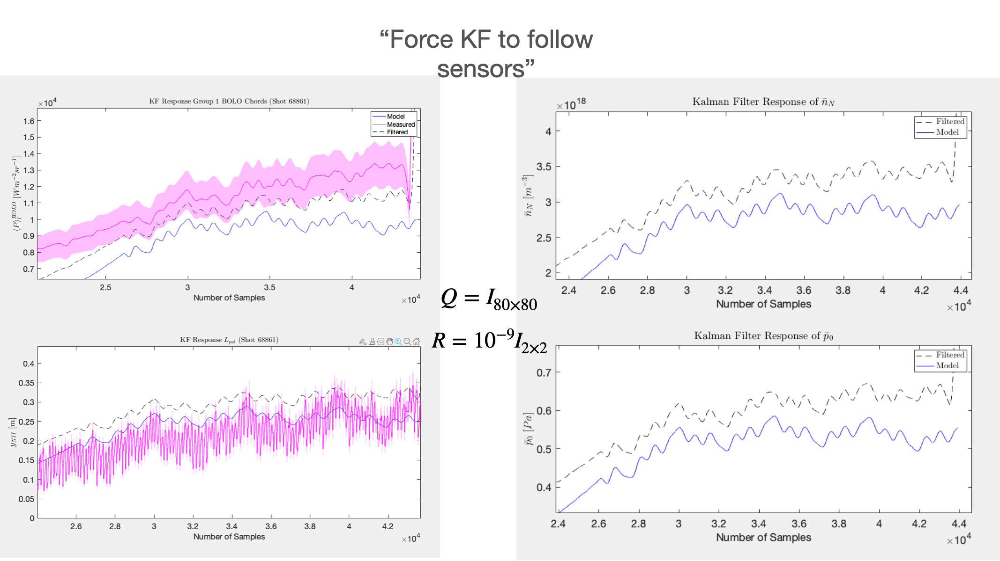
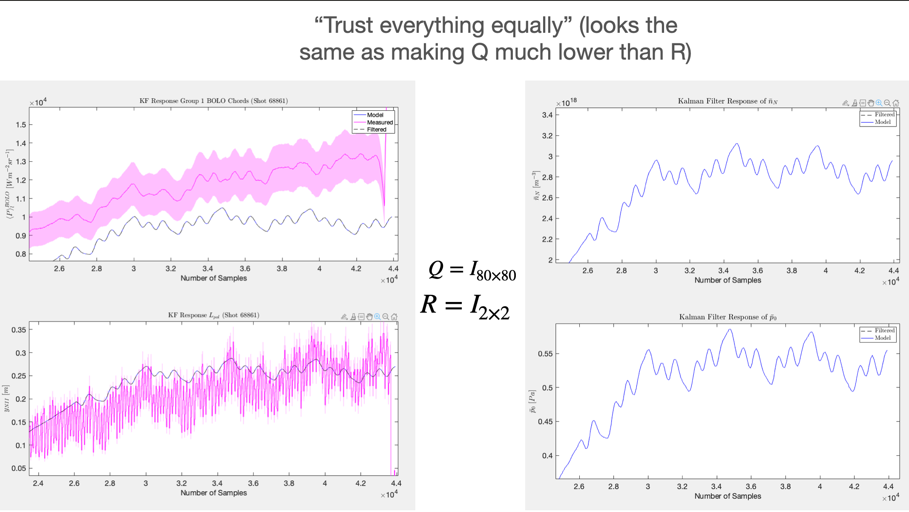
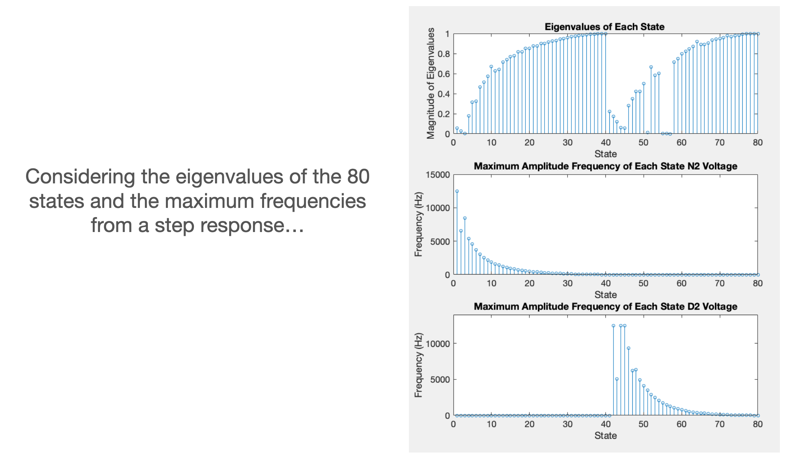
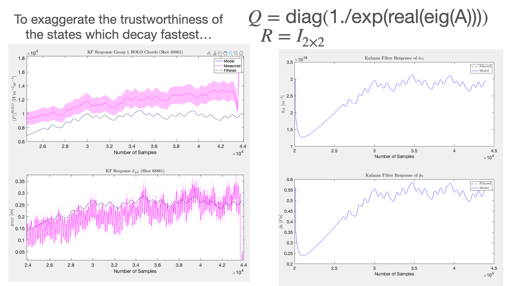
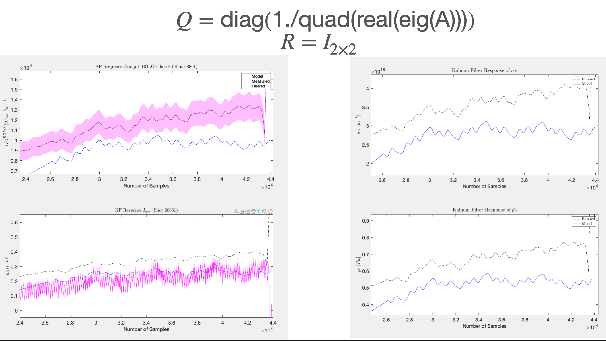
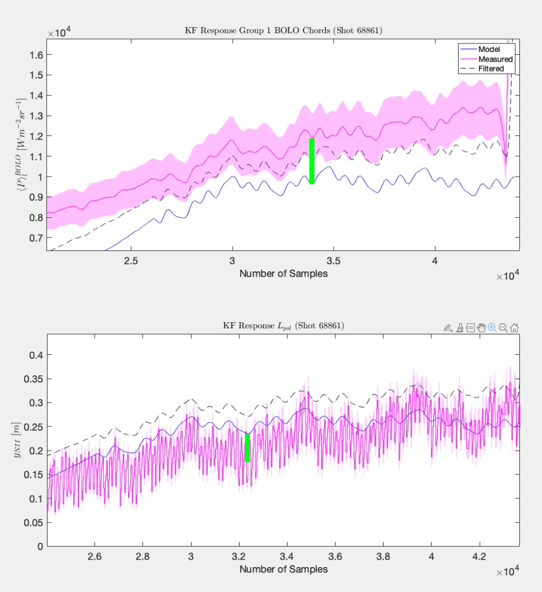
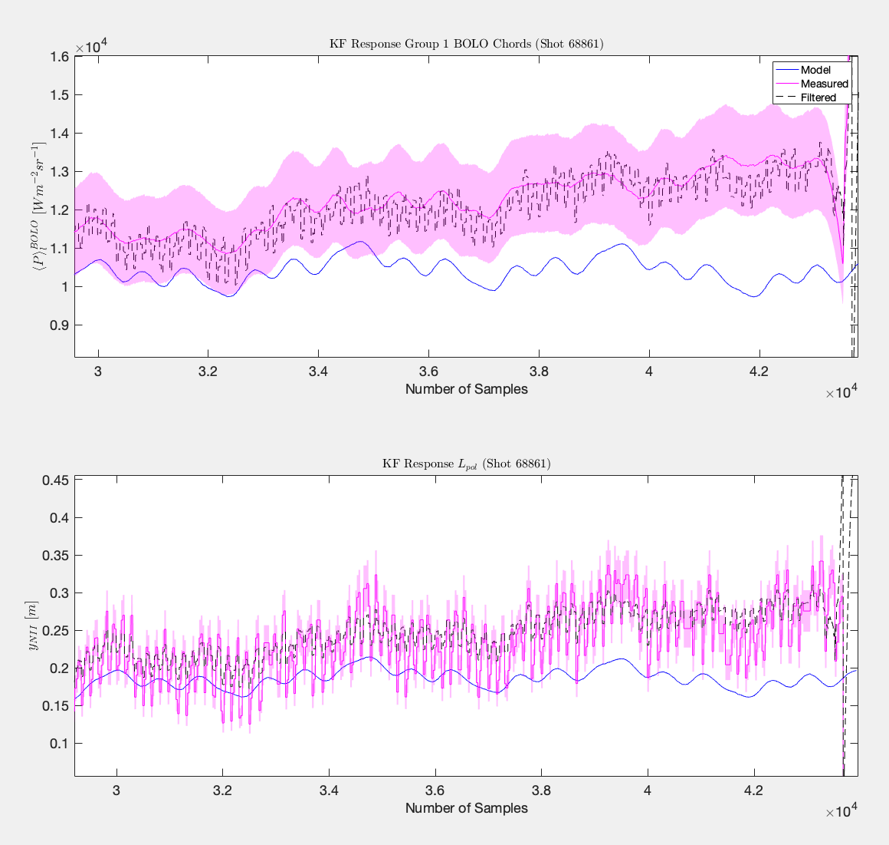
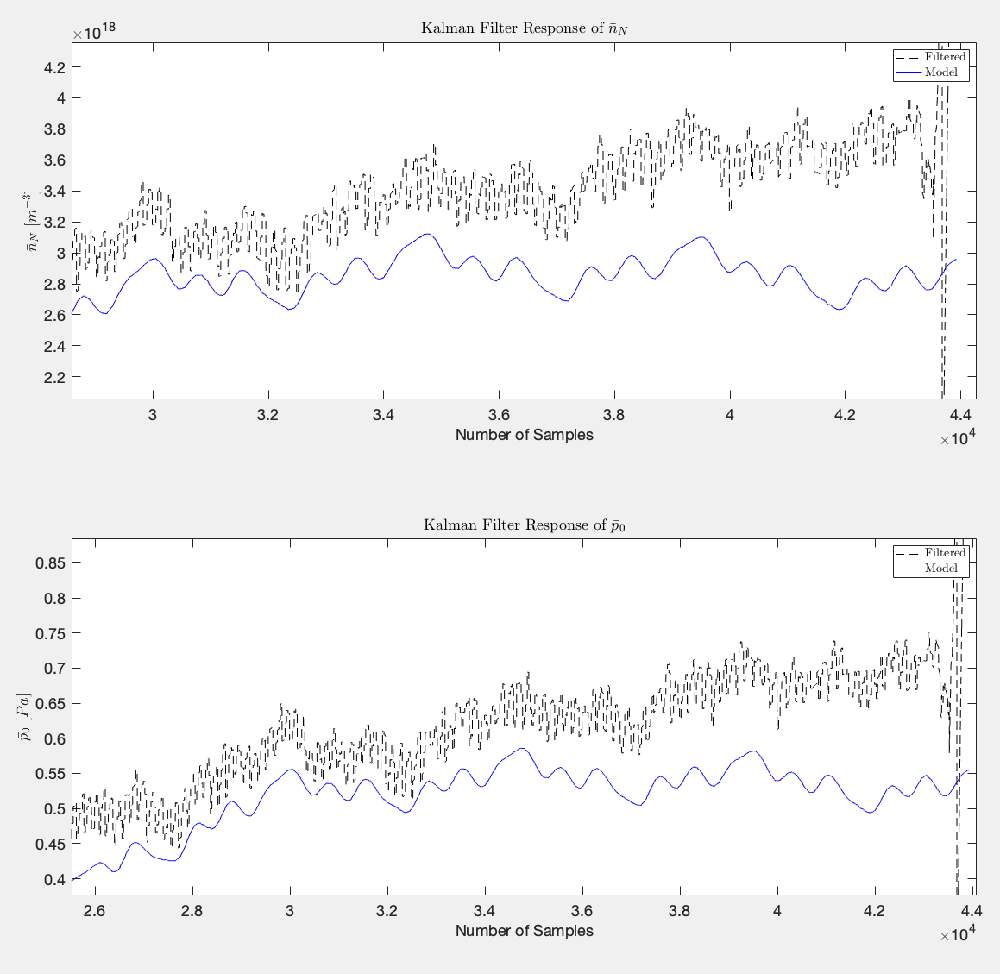

August 8th 2024

# Summary of Progress
In the past two weeks I have attempted the following:

1. Converted Jesse's model of $\hat{n}_e$ and $y_{NII}$ to $\bar{p}_0$ and $\bar{n}_N$ 
2. Figured out how to properly model Jesse's system (i.e., the correct inputs and outputs and the scaling factors thereof)
3. Rolled all this into my linear KF I have set up 

## Details

The model has been created as such:



**N.B.** The inputs here are no longer fluxes but voltages that Jesse transformed from the ones received by the gas valves.

This means the current model used for the KF (results shown below) is structured from the converted state space estimates from Jesse's $G_{L_{pol},D_2}$, $G_{L_{pol},N_2}$, $G_{n_{e},D_2}$ and $G_{n_{e},N_2}$ models as the state space version of:

$`\begin{align}
\begin{bmatrix}
G_{\bar{n}_N,D_2} &\ G_{\bar{n}_N,N_2} \\
G_{\bar{p}_0,D_2} &\ G_{\bar{p}_0,N_2}
\end{bmatrix}
\end{align}`$

Then I add my mapping $C$ which transforms $\bar{p}_0$ and $\bar{n}_N$ to synthetic outputs such as bolometeres or FIR or the NII front as measured by MANTIS. Which in turn looks like:

$`\begin{align}
\dot{\tilde{x}} &= \tilde{A}\tilde{x} + \tilde{B}\tilde{u} \\
y &= C\tilde{C}\tilde{x} + D\tilde{u}
\end{align}`$

Where the $\tilde{}$ represent the states and dynamics as created by converting matrix (1) into state space. The $D$ comes from the intercept in the fits of the synthetic diagnostics.








### What needs to be done next

1. Change Jesse's model's steady-state coniditon to reflect my SOLPS simulations. He does this in his previous papers by regressing $y_{NII}$ on $D_2$, but this needs to be done on $N_2$ as well, and then both of these regressions need to be done for $\hat{n}_e$. This is important as there is a linear offset as shown in [Jesse_p0_nN_LinOffset](JournalImages/Jesse_p0_nN_LinOffset.png). 

a. Need maps from $\Gamma_{N_2}$ $\Gamma_{D_2}$ to $\hat{n}^{FIR}_e$ and $y^{MANTIS}_{NII}$  
b. Need conversion from $\Gamma_{N_2}$ $\Gamma_{D_2}$ to voltages

Note: Alternatively, one could change $D$, within reason of the least-squares fit used to attain the intercepts in $D$.

For the 1st BOLO group mapping we have...
```
                    Estimate      SE       tStat       pValue  
                   ________    _______    ______    __________

    (Intercept)     1.2931     0.13544    9.5476    5.0153e-13
    x1             0.90291     0.07882    11.455    7.7553e-16
    x2              10.885     0.18215    59.759    1.3322e-49
```

For the NII front mapping we have...
```
                   Estimate        SE         tStat       pValue  
                   _________    _________    _______    __________

    (Intercept)    -0.051911     0.012247    -4.2387    9.2297e-05
    x1               0.05098    0.0071272     7.1528    2.8237e-09
    x2                0.3082     0.016471     18.712    9.4061e-25
```

If we add 5 standard errors to the BOLO1 intercept and substract 5 standard errors from the NII Front intercept and take...  

$`\begin{align} 
Q = \text{diag(inv\_quad\_eig)} \\
R = \begin{bmatrix} 5 \times 10^{-5} &\ 0 \\ 0 &\ 10^{-10}\end{bmatrix}
\end{align}`$

Then we have...




### New idea

Just use Jesse's original model (as it has more experimental validity than my transformed model) and then make synthetic mappings from $\hat{n}^{synth-FIR}_e$ and $y^{synth-MANTIS}_{NII}$ $\rightarrow$ $q_{tar}$, $T_{tar}$, $n_{Z}$. This could even turn into an EKF as the mappings likely need to be nonlinear.

## Bigger Picture

### Higher Level Notes on the Philosophy of this Thesis

1. We want to build an observer which can restruct a state based on measurements.
2. It is ideal if the states we reconstruct are SOLPS-ITER simulation parameters which uniquely identify a steady-state simulation, or at the very least that the state or output can be highly correlated with SOLPS-ITER critical parameters via synthetic diagnostics. **This is because we want to be able to observe non-measureable parameters from SOLPS**. For example: 

- If we could figure out how the SOLPS parameters $\bar{p}_0$ and $\bar{n}_N$ dynamically evolve then we could use mappings from these states to, e.g., $\hat{n}^{synth-FIR}_e$ and $y^{synth-MANTIS}_{NII}$ and a KF to reconstruct these states. From these states we could map to other SOLPS parameters like $q_{tar}$, $T_{tar}$, $n_{Z}$ to observe the condition of the divertor targets and impurity density.
- If $\hat{n}^{FIR}_e$ and $y^{MANTIS}_{NII}$ are the outputs then the synthetic mapping from $\hat{n}^{synth-FIR}_e$ and $y^{synth-MANTIS}_{NII}$ $\rightarrow$ $q_{tar}$, $T_{tar}$, $n_{Z}$ could be used to observe the condition of the divertor target and impurity density as predicted by SOLPS.