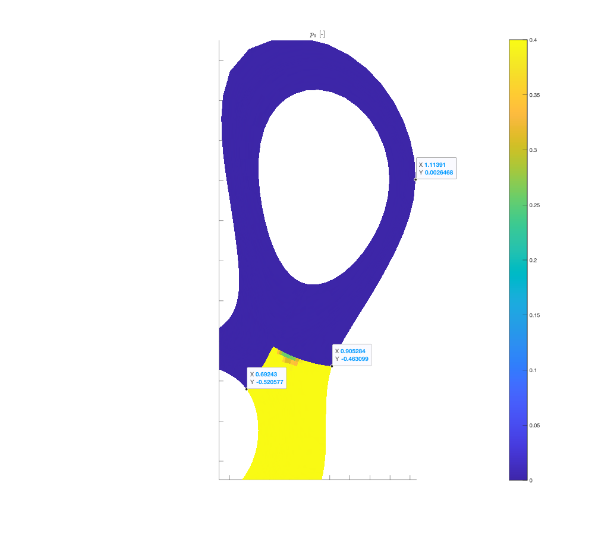

March 13th 2024

# Summary of the Day's Progress
Made some plots for the first time:  
1. Outer diverter region (and inner+outer region)
2. Plot of all 55 simulation poloidal views of $n_N$ and $p_0$
3. Plot of outer-divertor and outer+inner divertor region averaged $\bar{n}_N$ vs $\bar{p}_0$

Also, I have a Gitlab account now!

## Details
### $p_0$ over the outer divertor 

### Plot of all 55 simulation poloidal views of $n_N$ and $p_0$
I am pretty sure I ordered them as they are in Guangyu's table [see ProJourn 10:03:2024.md], but as you increase the nitrogen flux (moving right along the columns)the nitrogen density doesn't seem to increase. 

### Plot of outer-divertor and outer+inner divertor region averaged $\bar{n}_N$ vs $\bar{p}_0$

Probably the most relvant plot for my map. I should use this to make a decision about averaging over the inner leg or both inner and outer legs.

### N.B. about using FIR!!
The FIR lines go like:  

`[1.062 1.039 1.001 0.972 0.932 0.903 0.876 0.856 0.829 0.787 0.772 0.746 0.721 0.691][m]`

Which means that the only ones which cross over the divertor region are:  

`[0.903 0.876 0.856 0.829 0.787 0.772 0.746 0.721 0.691][m]`

But they don't even cross any part of the inner divertor region! So may not make sense to include it in the averages.

## Next Steps
0. Setup a Gitlab repo linked to this directory. Update the github, and push this local main to the DIFFER gitlab repo.
1. Check with Gijs and Jorn to see if this map is good enough (i.e., not too sparse) to proceed. Possibly look into a sparsness quantification.
2. Ask Gijs to run `SOLPS_SynthDiag_FIR.m` for the 55 simulations.

## Bigger Picture
Deciding on the *outer divertor region* or *inner+outer divertor region* to define the volume average of $p_0$ and $n_Z$ and a synthetic diagnostic (=start with FIR) --> $f(\bar{p}_0, \bar{n}_Z)$ --> using $f(\bar{p}_0, \bar{n}_Z)$ part of the kalman filter update step becomes $K(y - f(p_0, n_Z))$ where $y$ are the real sensor measurements 