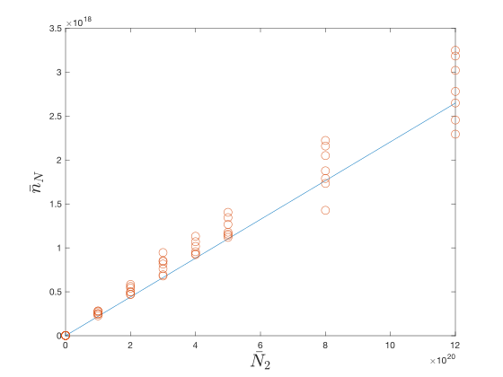
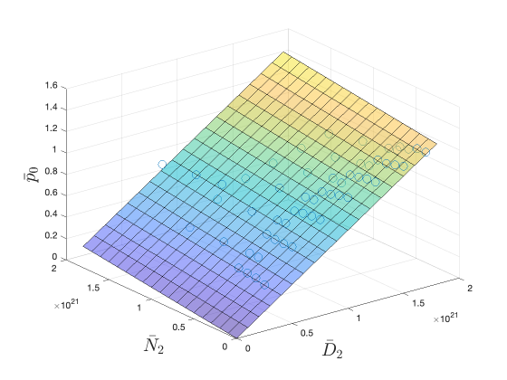

March 19th 2024

# Summary of the Day's Progress
Emailed Gijs, Jorn and Luke as well as found the linear transform `G` from the inputs to the state parameters.

## Details
### STATUS ON what...Gijs thinks I should...  
### 1. Plot $q_{tar}$ againt $\bar{p}_0, \bar{n}_Z$ (to see if sparsity in data is bad):
$q_{tar}$ = `q_par*sintheta + gamma_ion*E_ion` (conductive heat + recombination potential) Checked out a paper by Stangeby2018, but still can't figure out:  
    i. What the variables `gamma_ion` and `E_ion` are with respect to the paper  
    ii. What the variables `gamma_ion`, `E_ion`, and `sintheta` are w.r.t SOLPS-ITER values
### 2. Investigate the relationship between input and output:
`[nN;p0] = G*[N2_flux;D2_flux]` for the case where `G` is a scalar matrix has been solved for using least squares for values of `p0` and `nN` averaged over the outer divertor region.

`G = [2.2e-03,    2.0637e-04;  1.1117e-04,    7.29e-04]`  

`G(1,2)` is not 0, which you'd expect it to be since $\dot{D}_2$ should not change $\bar{n}_N$.

Plot of `G(1,1)*N2_flux` against data. It is ok, but a polynomial fit might do better as the fit does not pass through the center of the vertical "distribution lines".

Plot of `G(2,1)*N2_flux + G(2,2)*D2_flux` against data. It is ok, but again, a polynomial fit might do better. The shape of the fit surface in relation to the data points is better seen in the `.fig` version of this file.

### Luke Simons said...
He knows nothing about whether `SOLPS_SynDiag_BOLO.m` applies to RADCAM...he cc'ed me on an email with Elena Tonello.

### Sent Gijs an email...
1. Why do I need `G`?  
2. What are the variables to get $q_{tar}$? [see above]

## Next Steps
0. Setup a Gitlab repo linked to his directory. Update the github, and push this local main to the DIFFER gitlab repo. *Need to ask Gijs to setup a repo for me.*
1. Make sure that Gijs runs the simulations through the FIR synth diagnostic.
2. Plot $q_{tar}$ againt $\bar{p}_0, \bar{n}_Z$. Figure out what all the variables mean to calculate $q_{tar}$ from SOLPS-ITER simulations.
3. Solve `[nN;p0] = G*[N2_flux;D2_flux]` with fit techniques learned in class, but this time *assume some polynomial fit as opposed to linear*.
4. Move forward with averaging over outer region as FIR lines just cross outer region. Move forward with just nitrogen impurities from SOLPS-ITER as the carbon ones aren't that accurate and if the observer works without them, then it is more generalizable to other machines.
5. Try to get the transfer function dynamics of the TCV exhaust from Gijs et. al. With this it should be possible to simulate the dynamics of the state for experimental shots and therefore test/validate my observer. Also, make sure Gijs et. al's $p_0$ and $\bar{n}_Z$ are the same as mine.

6. For the next meeting with Jorn, make sure to have an updated calendar plan (the one that you included in your final prelude report).

## Bigger Picture
Deciding on the *outer divertor region* to define the volume average of $\bar{p}_0$ and $\bar{n}_N$ and a synthetic diagnostic (=start with FIR) --> $f(\bar{p}_0, \bar{n}_Z)$ --> using $f(\bar{p}_0, \bar{n}_Z)$ part of the kalman filter update step becomes $K(y - f(p_0, n_Z))$ where $y$ are the real sensor measurements --> validating/testing becomes using FRF system identification of TCV ecahust by Gijs et. al to update the state (i.e., the "State Model" block).

