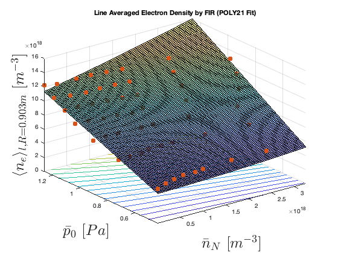

March 19th 2024

# Summary of the Day's Progress
Kind of validated $\bar{p}_0, \bar{n}_N$ data from SOLPS. Made different plots with results from `SOLPS_SynDiag_FIR.m`.

## Details  

### 0. Sort of validating $\bar{p}_0$, $\bar{n}_N$

-- Compared $\bar{p}_0$ to Pitts (2019):  
The neutral pressure is likely higher here because Pitts defines it at the target, but they are both on the same order of magnitude which is a good sign.  
  
-- Compared $\bar{n}_N$ to Wensing (2021):  
  
I assume here that "the line-average
density $\langle n_e\rangle _l$, taken from the far infrared interferometer chord
located at R = 0.903 m (FIR)" means that Wensing used `SOLPS_SynDiag_FIR.m`, but Guangyu said I should check with Holger to maybe be sure. The values of $\langle n_e\rangle _l$ that I have [see below] on this chord are maximum ~1.2e19.
-- Additionally, the plots of $\bar{p}_0$, $\bar{n}_N$ in [13:03:2024](ProgressJournal/13:03:2024.md) follow what one would expect with regards to $\dot{N}_2$ and $\dot{D}_2$. That is a decrease in $\bar{p}_0$ and increasing $\bar{n}_N$ with increasing $\dot{N}_2$ for fixed $\dot{D}_2$: showing a decrease in temperature and therefore pressure with increasing impurity influx. Also a slight decrease in $\bar{n}_N$ for fixed $\dot{N}_2$ valuse as $\dot{D}_2$ increases: likely as a decrease in impurity content due to increasing temperatures from fueling.
-- I think this is sufficient validation for now because Guangyu reminds me "the simulations [...] used different input power, plasma current, recycling coefficients, anomalous transport coefficients with Mirko's paper. I would be surprised if they yield the same results."
### 1. Plotting the diagnostics in SOLPS (i.e., FIR @R=0.903m)  

 
`Linear regression model:
    y ~ 1 + x1 + x2` 
|               | Estimate   | SE         | tStat   | pValue       |
|---------------|------------|------------|---------|--------------|
| (Intercept)   | -0.06237   | 0.031404   | -1.9861 | 0.052308     |
| x1            | 0.08904    | 0.0084856  | 10.493  | 1.9214e-14   |
| x2            | 0.97773    | 0.031223   | 31.315  | 2.0243e-35   |  

| Metric                                 | Value            |
|----------------------------------------|------------------|
| Number of observations                 | 55               |
| Error degrees of freedom               | 52               |
| Root Mean Squared Error                | 0.0551           |
| R-squared                              | 0.952            |
| Adjusted R-Squared                     | 0.95             |
| F-statistic vs. constant model         | 514              |
| p-value                                | 5.63e-35         |

  
`Linear regression model:
    y ~ 1 + x1^2 + x1*x2`
|               | Estimate   | SE        | tStat   | pValue      |
|---------------|------------|-----------|---------|-------------|
| (Intercept)   | 0.052967   | 0.042103  | 1.2581  | 0.21421     |
| x1            | -0.048639  | 0.04172   | -1.1658 | 0.24922     |
| x2            | 0.85663    | 0.042837  | 19.997  | 1.6642e-25  |
| x1^2          | 0.0055376  | 0.0080438 | 0.68843 | 0.49436     |
| x1:x2         | 0.13892    | 0.037184  | 3.7359  | 0.00048057  |  

| Metric                                 | Value            |
|----------------------------------------|------------------|
| Number of observations                 | 55               |
| Error degrees of freedom               | 50               |
| Root Mean Squared Error                | 0.0496           |
| R-squared                              | 0.962            |
| Adjusted R-Squared                     | 0.959            |
| F-statistic vs. constant model         | 321              |
| p-value                                | 5.65e-35         |

  
`Linear regression model:
    y ~ 1 + x1*x2 + x2^2 + x1:(x2^2) + x2^3`
|               | Estimate   | SE        | tStat    | pValue   |
|---------------|------------|-----------|----------|----------|
| (Intercept)   | 0.26839    | 0.12515   | 2.1446   | 0.037076 |
| x1            | -0.0088483 | 0.035641  | -0.24826 | 0.80499  |
| x2            | 0.70608    | 0.48978   | 1.4416   | 0.1559   |
| x1:x2         | 0.045457   | 0.091242  | 0.49821  | 0.62061  |
| x2^2          | -0.71913   | 0.59802   | -1.2025  | 0.23506  |
| x1:x2^2       | 0.091765   | 0.056481  | 1.6247   | 0.11077  |
| x2^3          | 0.59279    | 0.23138   | 2.562    | 0.013603 |  

| Metric                                 | Value            |
|----------------------------------------|------------------|
| Number of observations                 | 55               |
| Error degrees of freedom               | 48               |
| Root Mean Squared Error                | 0.0171           |
| R-squared                              | 0.996            |
| Adjusted R-Squared                     | 0.995            |
| F-statistic vs. constant model         | 1.86e+03         |
| p-value                                | 4.59e-55         |

**N.B.** These are coefficients and metrics for fit data that has been normalized as:  
`avg_nN_odiv'*1e-18`  
`nedl_shots*1e-19`  
Here `odiv` refers to the outer divertor region, the region over which these values were averaged.

-- Notice About the Plots...  
From the linear fit to the higher order `poly13`, the R-sqaured value hardly changes -- the change being only a 4.62% increase of the linear fit's R-squared value. Also the from the linear fit to the higher order `poly13` the RMSE value changes not too significantly -- the change being only a 69.15% decrease of the linear fit's RMSE value. This may be a good sign that a linear output may be possible. Made a GPR, but haven't found a good way to validate it besides doing kfold validation RMSE...can't figure out how to do it with polynomial fit...

### 2. I looked into GPR with KF  
I couldn't figure it out...or how to deal with a changing process noise on a Kalman Filter...  
Some Interesting Papers and Links:  
- [Theory Article+Video for GPRs](https://thegradient.pub/gaussian-process-not-quite-for-dummies/)
- [From-Scratch Coding Tutorial for GPRs](https://hannibunny.github.io/mlbook/machinelearning/GaussianProcessRegression.html)
- [Practical Python Coding Tutorial for GPRs](https://github.com/jwangjie/Gaussian-Process-Regression-Tutorial)
- [GPR Interactive Roel Sent Me](http://www.infinitecuriosity.org/vizgp/)  
- [Stack Exchange Question on Computing Gradient from GPR](https://stats.stackexchange.com/questions/373446/computing-gradients-via-gaussian-process-regression)  
**Just Want to Note That I Don't Think I Can Get an Analytical Function From GPR**  
- [Stack Exchange Explaining Std of Fit Coefficients](https://stats.stackexchange.com/questions/68151/how-to-derive-variance-covariance-matrix-of-coefficients-in-linear-regression)  
- [Good Explnantion of Bayesian Regression](https://www.analyticsvidhya.com/blog/2022/04/bayesian-approach-to-regression-analysis-with-python/)  
- [Oxford Robotics Paper Arguing GPR and KF are the Same Concept!](https://www.robots.ox.ac.uk/~sjrob/Pubs/Fusion2010_0132.pdf)
- [Tutorial On Bayesian Regression with Python](https://subhasish-basak-c-94990.medium.com/introduction-to-bayesian-optimization-a-simple-python-implementation-a98e28caf7ec)
- [Gaussian Process Lecture Notes](https://classes.cec.wustl.edu/~SEAS-SVC-CSE517A/lecturenotes/08_lecturenote_GPs.pdf)
- [Kfold Validation for Linear Fit With MATLAB (and therefore RMSE)](https://nl.mathworks.com/help/stats/classreg.learning.partition.regressionpartitionedlinear-class.html)  
- [Kfold Validation for GPR With MATLAB (and therefore RMSE)](https://nl.mathworks.com/help/stats/classreg.learning.partition.regressionpartitionedmodel.kfoldpredict.html)

## Next Steps
0. Update the github, and push this local main to the DIFFER gitlab repo. *Gijs has setup a repo for me.*
1. Try to get the transfer function dynamics of the TCV exhaust from Gijs et. al. With this it should be possible to simulate the dynamics of the state for experimental shots and therefore test/validate my observer. Also, make sure Gijs et. al's $\bar{p}_0$ and $\bar{n}_Z$ are the same as mine.  
2. Get $\langle n_e\rangle _l$ from FIR chords from the real experiments (e.g., shot #68861) which you based the sim request shots on that you were going to ask from Guangyu.

## Bigger Picture
Deciding on the *outer divertor region* to define the volume average of $\bar{p}_0$ and $\bar{n}_N$ and a synthetic diagnostic (=start with FIR) --> $f(\bar{p}_0, \bar{n}_Z)$ --> using $f(\bar{p}_0, \bar{n}_Z)$ part of the kalman filter update step becomes $K(y - f(p_0, n_Z))$ where $y$ are the real sensor measurements --> validating/testing becomes using FRF system identification of TCV ecahust by Gijs et. al to update the state (i.e., the "State Model" block).

