# End of March Update

## Bigger Picture
- Deciding on the *outer divertor region* to define the volume average of $\bar{p}_0$ and $\bar{n}_N$ and a synthetic diagnostic (=start with FIR) $\rightarrow$  
- $f(\bar{p}_0, \bar{n}_N)$ $\rightarrow$  
- Using $f(\bar{p}_0, \bar{n}_N)$ part of the kalman filter update step becomes $K(y - f(\bar{p}_0, \bar{n}_N))$ where $y$ are the real sensor measurements and $K$ comes from (among other things) the process noise as defined by the RMSE of the fit on $f(\bar{p}_0, \bar{n}_N)$ $\rightarrow$  
- Validating/testing both Kalman Filter and $f(\bar{p}_0, \bar{n}_N)$ comes down to using experimental data and the FRF system identification of TCV ecahust to update the state (i.e., the "State Model" block).

|  |
|:--:|
|Observer block diagram|

## What I've Done

### Using 55 SOLPS-ITER simulations $\rightarrow$ I averaged $p_0$ and $n_N$ over the outer divertor region:

| 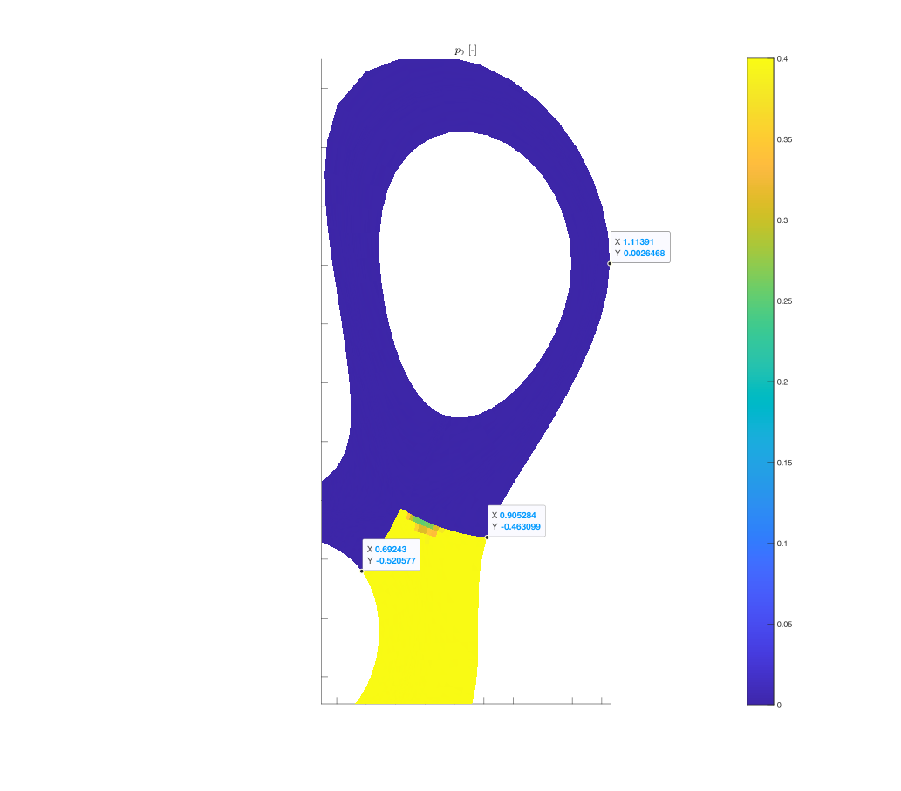 | 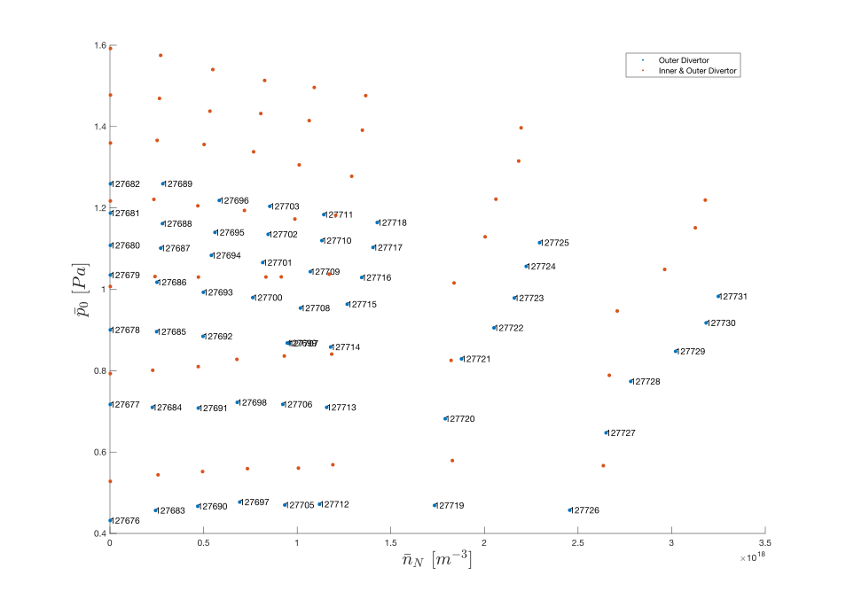 |
|:--------:|:-------:|
| Outer divertor region neutral pressure | 55 SOLPS simulations with varying deuterium flux and nitrogen flux |  

| 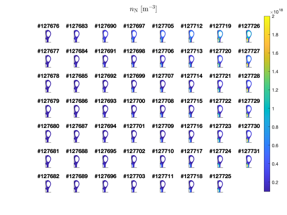 | 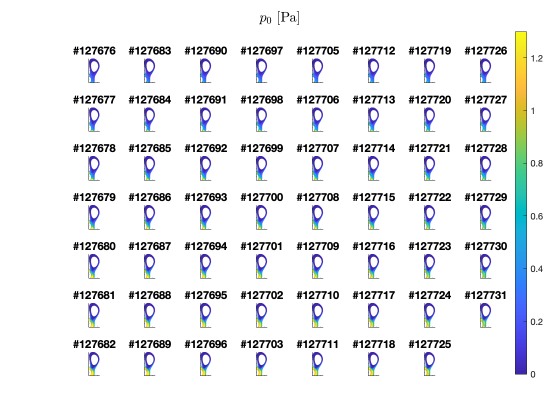 |
|:---------:|:-------:|
| 55 sims' poloidal view grid of nitrogen density | 55 sims' poloidal view grid of neutral pressure |

### Identified three synthetic diagnostics (FIR, BOLO, MANTIS $y_{CIII}$) $\rightarrow$ Made mappings from $\bar{p}_0$ and $\bar{n}_N$ to $\langle n_e\rangle _{l,FIR}$ @R=Central Chord:

**N.B** There are potentially 8 more FIR lines at locations:`[0.876 0.856 0.829 0.787 0.772 0.746 0.721 0.691][m]` over the outer leg!!

| 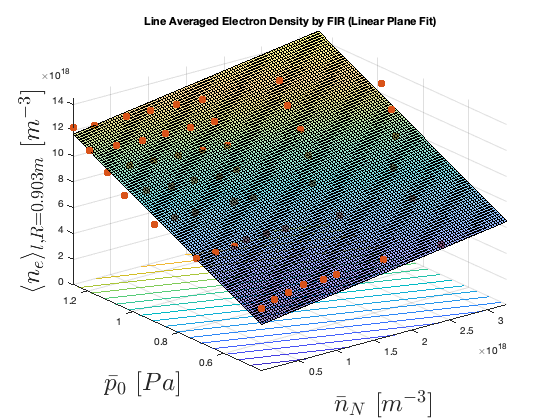 |
|:--:| 
|Linear regression model: `y ~ 1 + x1 + x2`|  

|               | Estimate   | SE         |
|---------------|------------|------------|
| (Intercept)   | -0.06237   | 0.031404   |
| x1            | 0.08904    | 0.0084856  |
| x2            | 0.97773    | 0.031223   |  

| Metric                                 | Value            |
|----------------------------------------|------------------|
| Error degrees of freedom               | 52               |
| Root Mean Squared Error                | 0.0551           |
| R-squared                              | 0.952            | 

|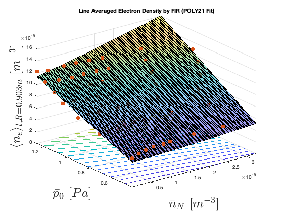|
|:--:| 
|Linear regression model: `y ~ 1 + x1^2 + x1*x2`|  

|               | Estimate   | SE        |
|---------------|------------|-----------|
| (Intercept)   | 0.052967   | 0.042103  |
| x1            | -0.048639  | 0.04172   |
| x2            | 0.85663    | 0.042837  |
| x1^2          | 0.0055376  | 0.0080438 |
| x1:x2         | 0.13892    | 0.037184  |  

| Metric                                 | Value            |
|----------------------------------------|------------------|
| Root Mean Squared Error                | 0.0496           |
| R-squared                              | 0.962            |

| 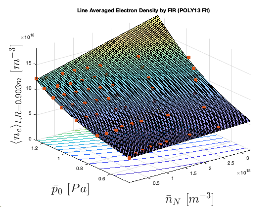 |
|:--:| 
| Linear regression model: `y ~ 1 + x1*x2 + x2^2 + x1:(x2^2) + x2^3` |  

|               | Estimate   | SE        |
|---------------|------------|-----------|
| (Intercept)   | 0.26839    | 0.12515   |
| x1            | -0.0088483 | 0.035641  |
| x2            | 0.70608    | 0.48978   |
| x1:x2         | 0.045457   | 0.091242  |
| x2^2          | -0.71913   | 0.59802   |
| x1:x2^2       | 0.091765   | 0.056481  |
| x2^3          | 0.59279    | 0.23138   |  

| Metric                                 | Value            |
|----------------------------------------|------------------|
| Root Mean Squared Error                | 0.0171           |
| R-squared                              | 0.996            |

### I validated the numbers via physical intuition $\rightarrow$ Attempted to validate via experimental data:

| 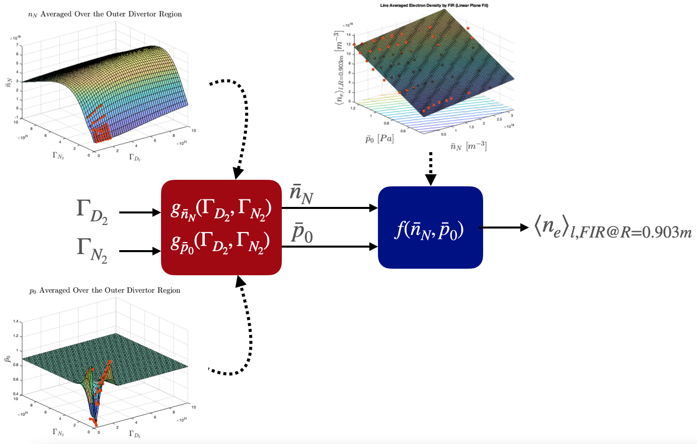 |
|:--:|
| Attempting to validate the mapping to average electron density of FIR @R=Central Chord |

Used GPR fits based on SOLPS-ITER for the red bloack. Probably doesn't work due to lack of dynamics information (i.e., doesn't take into account time dependence), or not isolating steady-state part of experiment correctly... 

|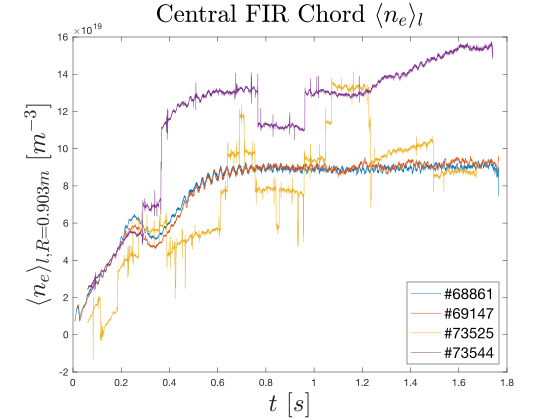 | 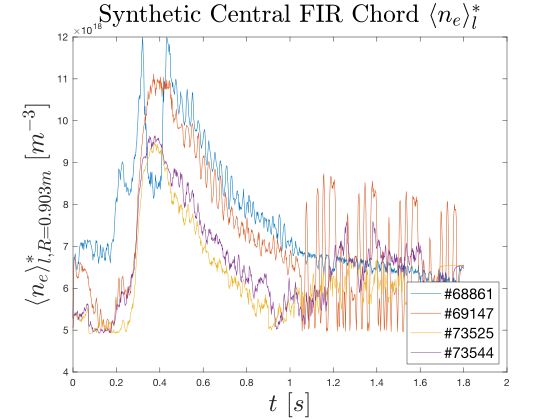|
|:--:|:--:|
|Experimental values from FIR|Synthetic mapping of FIR|

**N.B.** GPR based on SOLPS-ITER critically underestimates $\bar{n}_{N}$ given experimental shots which leads to an order magnitude underestimation of $\langle n_e\rangle _{l,FIR}$ @R=Central Chord:  

|  |
|:--:|
| Transfer functions and fits from TCV experiments to similar states |

## Thesis Calendar Update:  

    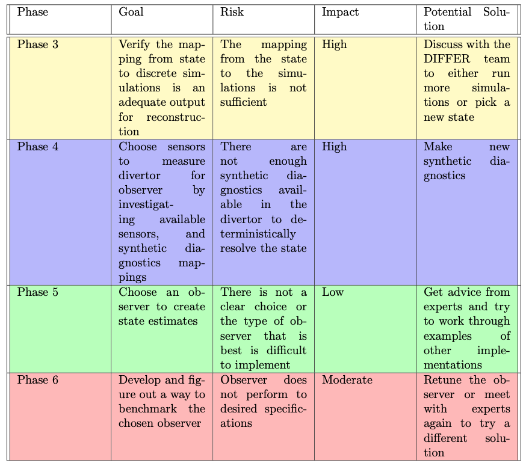
    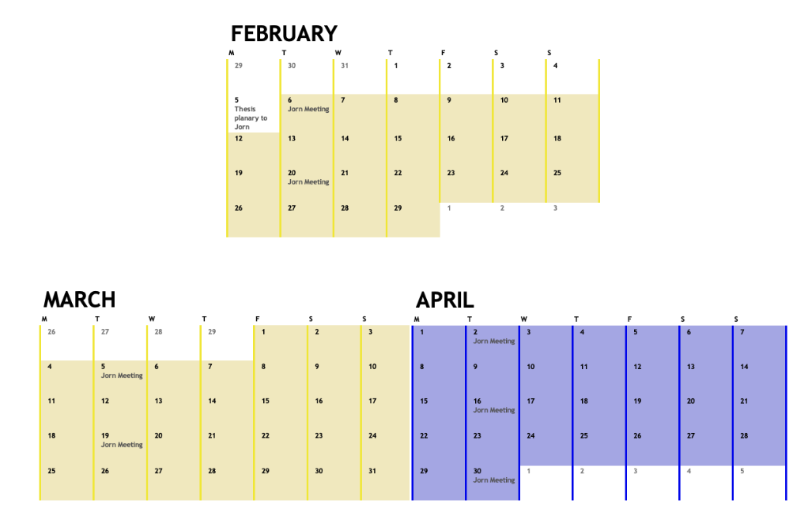
    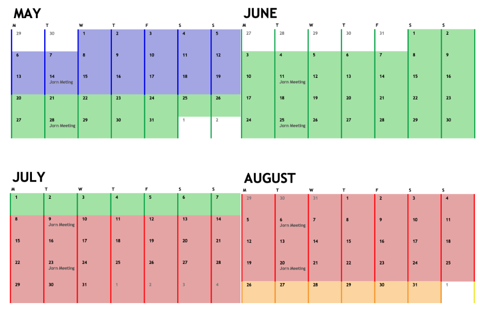

## Next Steps (and notes):

1. Recreate [Systematic extraction of a control-oriented model from perturbative experiments and SOLPS-ITER for emission front control in TCV](https://iopscience.iop.org/article/10.1088/1741-4326/ac5b8c), but from $\Gamma_{D_2}$ and $\Gamma_{N_2}$ to $\bar{n}_{N}$ and $\bar{p}_{0}$. Perhaps have two separate functions $g_{\bar{n}_N}(\Gamma_{D_2}, \Gamma_{N_2})$ $g_{\bar{p}_0}(\Gamma_{D_2}, \Gamma_{N_2})$ still. Confused on how to do this system identification properly...

- Notes:

2. Look into other FIR sight-lines, MANTIS $y_{CIII}$, and Bolometer for more output mappings.

- Notes:

3. Given these maps, look into which kalman filter is best: linear, extended, unscented.

- Notes;
