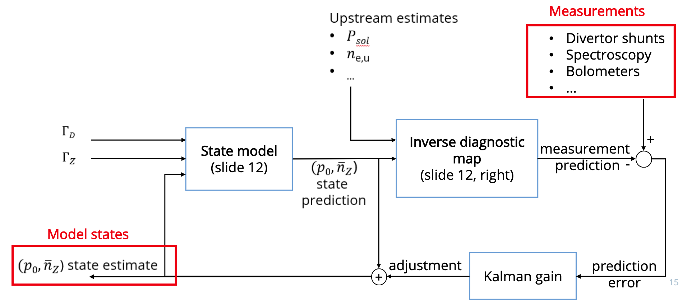
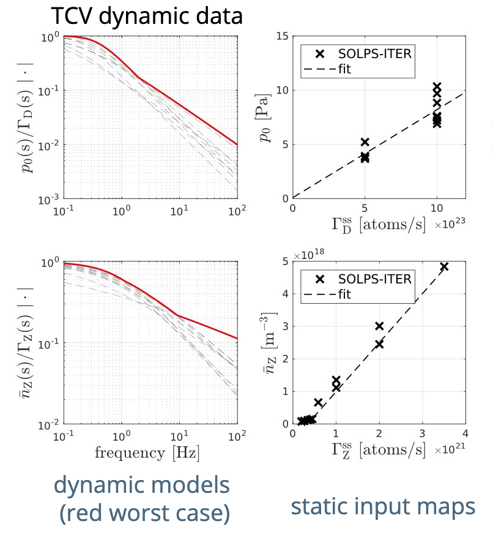

# End of March Update

## Bigger Picture
- Deciding on the *outer divertor region* to define the volume average of $\bar{p}_0$ and $\bar{n}_N$ and a synthetic diagnostic (=start with FIR) $\rightarrow$  
- $f(\bar{p}_0, \bar{n}_N)$ $\rightarrow$  
- Using $f(\bar{p}_0, \bar{n}_N)$ part of the kalman filter update step becomes $K(y - f(\bar{p}_0, \bar{n}_N))$ where $y$ are the real sensor measurements and $K$ comes from (among other things) the process noise as defined by the RMSE of the fit on $f(\bar{p}_0, \bar{n}_N)$ $\rightarrow$  
- Validating/testing both Kalman Filter and $f(\bar{p}_0, \bar{n}_N)$ comes down to using experimental data and the FRF system identification of TCV ecahust to update the state (i.e., the "State Model" block).

## What I've Done

1. Using 55 SOLPS-ITER simulations $\rightarrow$ I averaged $p_0$ and $n_N$ over the outer divertor region:

2. Identified three synthetic diagnostics (FIR, BOLO, possibly MANTIS via DSS) $\rightarrow$ Made mappings from $\bar{p}_0$ and $\bar{n}_N$ to $\langle n_e\rangle _{l,FIR}$ @R=Central Chord:

   
`Linear regression model:
    y ~ 1 + x1 + x2` 
|               | Estimate   | SE         |
|---------------|------------|------------|
| (Intercept)   | -0.06237   | 0.031404   |
| x1            | 0.08904    | 0.0084856  |
| x2            | 0.97773    | 0.031223   |  

| Metric                                 | Value            |
|----------------------------------------|------------------|
| Error degrees of freedom               | 52               |
| Root Mean Squared Error                | 0.0551           |
| R-squared                              | 0.952            |

  
`Linear regression model:
    y ~ 1 + x1^2 + x1*x2`
|               | Estimate   | SE        |
|---------------|------------|-----------|
| (Intercept)   | 0.052967   | 0.042103  |
| x1            | -0.048639  | 0.04172   |
| x2            | 0.85663    | 0.042837  |
| x1^2          | 0.0055376  | 0.0080438 |
| x1:x2         | 0.13892    | 0.037184  |  

| Metric                                 | Value            |
|----------------------------------------|------------------|
| Root Mean Squared Error                | 0.0496           |
| R-squared                              | 0.962            |

  
`Linear regression model:
    y ~ 1 + x1*x2 + x2^2 + x1:(x2^2) + x2^3`
|               | Estimate   | SE        |
|---------------|------------|-----------|
| (Intercept)   | 0.26839    | 0.12515   |
| x1            | -0.0088483 | 0.035641  |
| x2            | 0.70608    | 0.48978   |
| x1:x2         | 0.045457   | 0.091242  |
| x2^2          | -0.71913   | 0.59802   |
| x1:x2^2       | 0.091765   | 0.056481  |
| x2^3          | 0.59279    | 0.23138   |  

| Metric                                 | Value            |
|----------------------------------------|------------------|
| Root Mean Squared Error                | 0.0171           |
| R-squared                              | 0.996            |

3. I validated the numbers via physical inuition $\rightarrow$ Attempted to validate via experimental data:

Used GPR fits based on SOLPS-ITER. Probably doesn't work due to lack of dynamics information (i.e., doesn't take into account time dependence), or not isolating steady-state part of experiment correctly... 

  

GPR based on SOLPS-ITER critically underestimates $\bar{n}_{N}$ given experimental shots which leads to an order magnitude underestimation of $\langle n_e\rangle _{l,FIR}$ @R=Central Chord $\rightarrow$ Solution is to use transfer functions obtained from TCV (and ask what else might be going wrong):  

